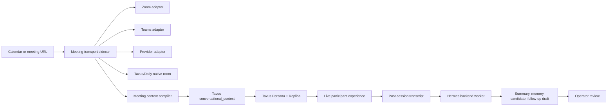

# Hal Meeting Transport Sidecar

Status: dry-run spike
Date: 2026-06-25

## Why This Exists

Brian's desired product shape appears to require Hal to join existing Zoom or Microsoft Teams meetings, not only host a Tavus room. That is a real gating capability for Hal.

The current Hal/Dani-style backend does not have that transport layer. It can create a Tavus conversation, inject `conversational_context`, receive callbacks/transcripts, and hand post-session work to a Hermes-style backend worker. It cannot currently join a third-party Zoom or Teams meeting as a participant.

This sidecar defines the missing plug-in layer without changing the safe Tavus foundation.

## Product Claim Boundary

Safe claim today:

> Hal has a dry-run meeting-transport plan for Zoom and Teams. The current prototype can prepare the meeting brief and Tavus context, but it does not yet join external meetings.

Unsafe claim today:

> Hal can join Zoom or Teams calls.

That claim becomes safe only after a live transport adapter joins a real meeting with visible AI identity, media bridge, consent handling, transcript capture, failure handling, and operator-reviewed memory workflow.

## Architecture



## Responsibility Split

### Meeting Transport Sidecar

- detect Zoom, Teams, Google Meet, or Tavus/Daily links;
- verify host authorization and participant disclosure requirements;
- create a sidecar session record;
- join the meeting through an approved adapter;
- bridge meeting audio/video to the Tavus conversational layer or approved equivalent;
- capture transcript and meeting events;
- emit a normalized `hal.meeting.completed` event.

### Tavus

- provide Hal's face, voice, turn-taking, persona behavior, knowledge retrieval, and conversational response;
- receive a tightly scoped meeting context packet;
- return conversation metadata and transcripts through callbacks or explicit fetch;
- avoid public shared memory by default.

### Hermes

- compile pre-meeting brief inputs;
- classify source scope and authority;
- prepare `conversational_context`;
- process post-session transcript;
- create memory candidates and action drafts;
- require operator approval before durable memory or outbound action.

Hermes makes the operating system stronger. It does not replace the Zoom/Teams transport adapter.

## Adapter Options

### Zoom Lane

Likely implementation options:

- Zoom Meeting SDK based bot;
- managed meeting-bot provider with Zoom support;
- future vendor-native Tavus/Anam transport if they expose a supported API.

Minimum requirements:

- meeting URL parser and meeting password handling;
- bot identity such as `Hal (AI)`;
- waiting-room and host-admit behavior;
- explicit AI disclosure;
- audio in/out;
- avatar/video output or audio-only fallback;
- transcript and participant event capture;
- no hidden impersonation.

### Teams Lane

Likely implementation options:

- Microsoft Graph Cloud Communications bot;
- Azure Bot registration with Teams calling enabled;
- managed meeting-bot provider with Teams support;
- future vendor-native transport if available.

Minimum requirements:

- tenant/admin eligibility check;
- Teams bot identity and app registration;
- online meeting join flow;
- media handling;
- visible AI disclosure;
- meeting policy compatibility;
- transcript and participant event capture.

### Provider Lane

A provider can compress the schedule if it already supports Zoom/Teams/Meet joining and media bridge. It still must pass Hal's identity, consent, and transcript governance.

Provider acceptance questions:

- Can it join as a named AI participant?
- Can it stream a Tavus-like avatar/video feed, not only record?
- Can it pass real-time audio into Hal and play Hal's response back?
- Can it expose event and transcript hooks?
- Can it support a strict no-impersonation disclosure?
- Can it avoid storing private meeting content outside the approved scope?

## Dry-Run Sidecar Contract

The local preview route is:

```text
POST /api/hal/meeting-transport/preview
```

Example body:

```json
{
  "meeting_url": "https://zoom.us/j/123456789",
  "host_authorized": true,
  "visible_ai_disclosure": true,
  "meeting_title": "Long Strange Trip guest planning",
  "principal": "Brian Halligan",
  "deployment_profile": "PUBLIC_DEMO"
}
```

The route returns:

- detected platform;
- whether current backend can join directly;
- recommended adapter lane;
- Tavus/Hermes plug-in points;
- missing approvals;
- boundary booleans proving no live call was attempted.

## Release Gates

Block release until:

- the adapter can join a real Zoom or Teams meeting in a controlled test;
- the visible participant name discloses AI identity;
- the host can admit/remove Hal;
- a test proves Hal does not claim to be Brian;
- a test proves participant speech cannot elevate authority;
- post-session transcript handling excludes raw sensitive data from memory;
- follow-up actions remain drafts unless a tool returns a success receipt;
- failure states are user-visible and logged.

## MVP Recommendation

Build this as a sidecar first, then plug it into Hal only after a live transport lane passes:

1. dry-run planner and preview route;
2. synthetic meeting-session state machine;
3. provider bake-off: Zoom SDK, Teams Graph, or managed meeting-bot provider;
4. one live controlled Zoom test with a stock/non-Brian replica;
5. one live controlled Teams test;
6. Tavus/Hermes post-session handoff;
7. operator-reviewed release.

This keeps the product aligned with Brian's requirement without pretending the transport problem is already solved.
